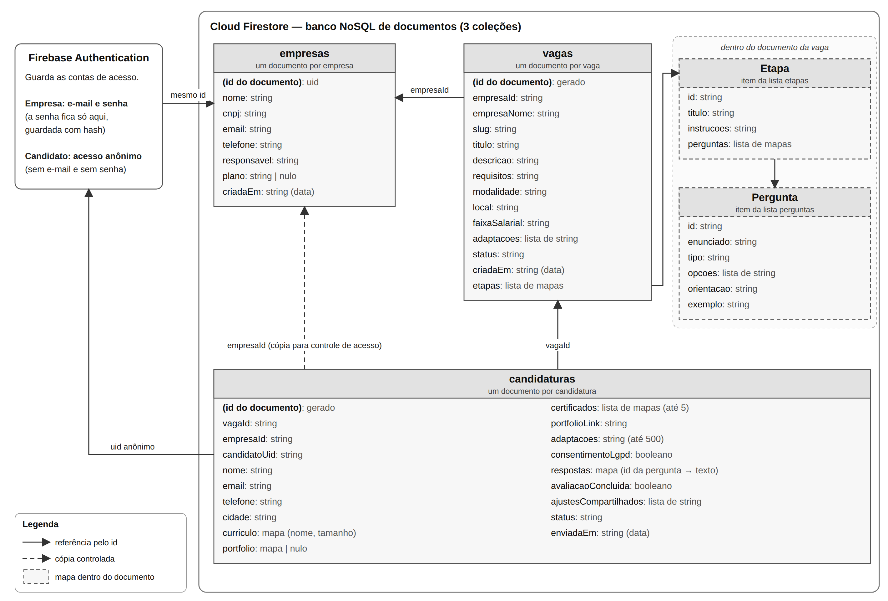

# NeuroWork

Plataforma web de recrutamento neuroinclusivo. Todas as telas do backlog (FE01–FE19), avaliação adaptada a cada candidato e banco de dados **Cloud Firestore** com **Firebase Authentication**.

O sistema roda de dois jeitos:

| Modo | Quando | Dados |
|---|---|---|
| **Firebase** | Com as chaves no arquivo `.env.local` | Firestore + Authentication (dados reais, compartilhados) |
| **Demonstração** | Sem `.env.local` | Dados de exemplo salvos no navegador (bom para apresentar sem internet) |

TCC — Turma DS302: Hilario Feliciano Neto, Igor Gabriel Pasquali, Kaue Mezzomo Mazzonetto e Pedro Luan Chaikoski.

## Tecnologias

| Tecnologia | Uso |
|---|---|
| Next.js 15 (App Router) + React 19 | Aplicação e navegação entre telas |
| TypeScript | Tipagem de todo o código |
| Tailwind CSS 4 | Estilização e layout responsivo |
| shadcn/ui (Radix UI) | Componentes base (botão, card, diálogo…) |
| lucide-react | Ícones |
| React Hook Form + Yup | Formulários e validação de campos |
| Sonner | Mensagens de feedback (toast) |
| Firebase Authentication | Login das empresas (e-mail e senha) e login anônimo dos candidatos |
| Cloud Firestore | Banco de dados, protegido por regras de segurança (`firestore.rules`) |
| Web Speech API (navegador) | Ler perguntas em voz alta e responder falando |

## Identidade visual

A interface segue o Manual de Identidade Visual do NeuroWork:

| Uso | Cor |
|---|---|
| Azul principal (logo, ícones, foco) | `#1E88E5` |
| Verde (logo, destaques) | `#43A047` |
| Cinza escuro (texto) | `#263238` |
| Cinza claro (superfícies) | `#ECEFF1` |
| Azul-marinho (menu, títulos, rodapé) | `#0D2A5C` |

Tipografia: **Montserrat** nos títulos e **Roboto** no texto (via `next/font/google`).

**Acessibilidade das cores:** o azul `#1E88E5` e o verde `#43A047` têm contraste de 3,7:1 e 3,3:1 com o branco, abaixo dos 4,5:1 exigidos pela WCAG para texto. Por isso, botões, links e textos usam tons mais escuros da mesma família (`#1565C0` e `#2E7D32`), e as cores originais ficam no logotipo, em ícones e em detalhes. Todos os tokens estão em `src/app/globals.css`.

O símbolo do logo foi redesenhado em SVG (`src/components/brand/logo-symbol.tsx` e `public/brand/neurowork-simbolo.svg`). Se tiverem o arquivo vetorial original do logo, basta substituir esses dois arquivos.

## Como rodar

Pré-requisito: Node.js 20 ou superior.

```bash
npm install
npm run dev
```

Abra http://localhost:3000.

**Conta de demonstração (só no modo demonstração):** `demo@neurowork.com.br` / `neurowork123` (a tela de login tem um botão que preenche os dados).

Outros comandos:

```bash
npm run build      # build de produção (também roda lint e checagem de tipos)
npm run lint       # ESLint
npm run typecheck  # só a checagem do TypeScript
npm test           # 12 testes automatizados da camada de serviços
```

## Testes automatizados

Os testes usam o executor de testes nativo do Node.js (`node:test`). O `tsx` permite rodar os arquivos TypeScript do projeto direto, sem compilar antes.

| Comando | Arquivo | O que testa |
|---|---|---|
| `npm test` | `tests/neurowork.test.ts` | 12 testes da camada de serviços no modo demonstração (sem internet) |
| `npm run test:regras` | `tests/regras-firestore.test.ts` | 14 testes das regras de segurança do banco, no emulador do Firebase (precisa do Java 21 ou mais novo) |

Os 12 testes seguem as linhas da Tabela 1 da monografia, dois por linha:

| Grupo | Testes |
|---|---|
| Cadastro e login da empresa | A empresa cadastrada entra e vê os próprios dados; e-mail sem conta, senha errada e cadastro repetido são recusados |
| Isolamento entre empresas | Uma empresa não vê, não abre, não altera e não exclui as vagas e as candidaturas de outra |
| Criação de vaga e link | A vaga aparece pelo link público, sem login; vaga encerrada não recebe candidaturas e volta ao ser reaberta |
| Candidatura e avaliação adaptada | A candidatura chega à empresa com as respostas e os ajustes compartilhados; o aceite da LGPD é obrigatório e nenhum campo de condição ou diagnóstico é guardado |
| Certificados, exclusão e backup | Até 5 certificados em PDF de até 5 MB; a candidatura excluída (pela empresa ou pelo candidato) some, e o backup traz só os dados da empresa |
| Banco de perguntas e atalhos | 16 perguntas em 7 categorias, sem termos de saúde; os atalhos só sugerem ajustes que existem |

Os 14 testes das regras tentam operar direto no banco, como faria alguém que alterasse o código do site: gravar um campo de diagnóstico, enviar sem o aceite da LGPD, candidatar-se a vaga encerrada, mudar o próprio status, ler ou alterar dados de outra empresa, trocar o CNPJ, entre outros. Todas essas tentativas precisam ser recusadas pelo servidor; a candidatura válida e a mudança de status pela empresa precisam ser aceitas.

No modo demonstração, cada operação espera de 0,3 a 1,2 segundo para mostrar os estados de carregamento; durante os testes essa espera é pulada.

## Configurar o Firebase (banco de dados)

Sem esta parte, o sistema funciona no modo demonstração. Para usar o banco real:

1. **Crie o projeto:** acesse https://console.firebase.google.com, clique em **Adicionar projeto**, dê o nome `neurowork` e conclua (o Google Analytics pode ficar desligado). O plano gratuito (Spark) é suficiente.
2. **Registre o app da Web:** na página do projeto, clique no ícone **`</>`**, dê um apelido (ex.: `neurowork-web`) e clique em **Registrar app**. Aparece um bloco `firebaseConfig` com as chaves; deixe-o aberto.
3. **Crie o arquivo `.env.local`:** na pasta do projeto, copie o `.env.example` para `.env.local` e preencha cada linha com o valor correspondente do `firebaseConfig` (`apiKey` → `NEXT_PUBLIC_FIREBASE_API_KEY`, e assim por diante).
4. **Ative o login:** no menu **Criação → Authentication → Começar → Método de login**, ative **E-mail/senha** (empresas) e **Anônimo** (candidatos, que não criam conta).
5. **Crie o banco:** em **Criação → Firestore Database → Criar banco de dados**, escolha o local `southamerica-east1 (São Paulo)` e comece no **modo de produção**.
6. **Publique as regras de segurança:** no Firestore, aba **Regras**, apague o conteúdo, cole todo o arquivo `firestore.rules` deste projeto e clique em **Publicar**.
7. **Reinicie o projeto** (`Ctrl + C` e `npm run dev`). O login de demonstração some e o sistema passa a usar o Firebase. Crie a conta da empresa em **Criar conta**.

8. **Popule o banco (opcional):** veja a seção abaixo.

> As chaves do `.env.local` identificam o projeto e ficam visíveis no navegador; isso é normal no Firebase. Quem protege os dados são as **regras de segurança**. O `.env.local` não vai para o GitHub (está no `.gitignore`).

### Popular o banco com dados de exemplo

O script `scripts/popular-banco.ts` cria no Firestore os mesmos dados do modo demonstração (`src/data/seed.ts`): a empresa Aurora Tecnologia, 3 vagas com etapas e perguntas e 5 candidaturas com respostas. Assim, a apresentação no banco real começa com dados prontos.

1. Faça os passos 1 a 6 acima (projeto, `.env.local`, login, banco e regras publicadas).
2. No `.env.local`, preencha `SEED_EMPRESA_EMAIL` e `SEED_EMPRESA_SENHA` (a conta da empresa de exemplo; escolha uma senha só sua, com pelo menos 8 caracteres, letras e números).
3. Rode:

```bash
npm run db:popular
```

O script usa o mesmo SDK do site, com a conta da empresa e candidatos anônimos, então **passa pelas mesmas regras de segurança** e não precisa de chave de administrador. No fim, ele mostra os links das vagas. Se a empresa já tiver vagas no banco, ele para sem gravar nada, para não duplicar os dados.

### Testar o banco no emulador (no próprio computador)

O emulador do Firebase roda o Authentication e o Firestore localmente, com as regras do `firestore.rules`, sem usar o projeto real. Precisa do Java (JDK) 21 ou mais novo instalado.

```bash
npm run db:emulador
```

O comando liga o emulador, roda o `db:popular` nele (com a conta de demonstração) e desliga tudo no fim. Se as regras recusarem alguma gravação, o script avisa e termina com erro.

### Como os dados ficam no Firestore

O diagrama `docs/banco-de-dados-firestore.png` mostra as coleções, os campos e as ligações entre elas (o arquivo `.svg` ao lado é a versão editável).



| Coleção | Documento | Quem lê | Quem altera |
|---|---|---|---|
| `empresas` | Um por empresa (id = id do usuário) | A própria empresa | A própria empresa (CNPJ e e-mail bloqueados) |
| `vagas` | Um por vaga, com as etapas e perguntas dentro | Qualquer pessoa, se a vaga estiver aberta; a empresa dona, sempre | Só a empresa dona |
| `candidaturas` | Uma por candidatura | A empresa da vaga e o próprio candidato | Candidato: respostas até enviar. Empresa: só o status |

Não há índices compostos para criar: todas as consultas do site usam só filtros de igualdade (por exemplo, `empresaId == ...`), que o Firestore atende com os índices automáticos.

O candidato recebe um **login anônimo** automático: não cria conta nem senha, mas só ele consegue continuar a própria avaliação. As regras também têm uma **lista fechada de campos** para a candidatura, então não é possível gravar diagnóstico ou qualquer dado extra, mesmo alterando o código do site.

## Avaliação adaptada (diferencial de neuroinclusão)

Depois de enviar os dados, o candidato escolhe **como prefere fazer a avaliação** (`/vaga/[slug]/ajustes`):

| Ajuste | O que muda |
|---|---|
| Uma pergunta por tela | Modo foco, com progresso em blocos |
| Botão de pausa | Tela calma de pausa; as respostas ficam salvas |
| Pergunta explicada passo a passo | Mostra "o que a empresa quer saber", um exemplo e quantas perguntas faltam |
| Texto maior e mais espaçado | Letras maiores, mais espaço e fundo creme |
| Ler as perguntas em voz alta | Cada pergunta é lida quando aparece |
| Responder falando | A fala vira texto (Chrome e Edge) |

Há um **atalho opcional** (Autismo, TDAH, Dislexia) que só marca ajustes sugeridos. **A condição escolhida não é salva nem enviada:** fica apenas na memória daquela tela. O candidato pode, se quiser, mostrar à empresa **os nomes dos ajustes** que usou. Assim, o sistema não trata dado de saúde (dado sensível pela LGPD, art. 11) e evita discriminação. As perguntas são as mesmas para todos; muda só a forma de apresentar.

Na montagem do processo seletivo, a empresa pode escrever, em cada pergunta, a explicação direta e um exemplo de resposta usados pelo ajuste "passo a passo".

**Banco de perguntas NeuroWork (RF-17):** a equipe oferece 16 modelos de perguntas, em 7 categorias, já escritos em linguagem clara e literal, com explicação e exemplo. A empresa escolhe quais usar, edita o texto ou cria as próprias perguntas. Os modelos ficam em `src/data/banco-perguntas.ts`.

## Roteiro de demonstração (fluxo principal)

1. **Empresa:** entre com a conta de demonstração (ou crie uma em "Criar conta").
2. **Vagas → Criar vaga:** preencha o formulário. Ao salvar, o link da vaga aparece para copiar.
3. **Montar processo seletivo:** adicione etapas e perguntas; use "Ver como o candidato".
4. **Candidato:** abra o link da vaga (de preferência em outra aba), candidate-se sem conta e anexe um PDF. Na tela de ajustes, escolha um atalho (ex.: TDAH), veja o exemplo em "Ver como vai ficar" e responda à avaliação.
5. **Empresa:** em **Candidatos**, abra a candidatura, veja as respostas e altere o status.
6. **Relatórios** e **Plano** (contratação simulada, sem cobrança).

> No modo demonstração, os dados ficam no `localStorage` do navegador. Para voltar ao estado inicial, use **"Restaurar dados de exemplo"** no menu do painel.

## Organização das pastas

```
src/
├── app/                        # Rotas (App Router): cada pasta é uma URL
│   ├── page.tsx                # Landing page
│   ├── (auth)/                 # Cadastro, login e recuperação de senha
│   ├── painel/                 # Área da empresa (protegida por sessão)
│   │   ├── vagas/              # Lista, criar, detalhe, editar e processo seletivo
│   │   ├── candidatos/         # Lista e detalhe do candidato
│   │   ├── plano/              # Meu plano e checkout simulado
│   │   ├── relatorios/         # Relatório por vaga
│   │   └── empresa/            # Dados da conta da empresa
│   ├── privacidade/            # Política de privacidade (LGPD)
│   └── vaga/[slug]/            # Jornada do candidato (link público, sem conta)
│       ├── candidatura/        # Formulário em etapas
│       ├── ajustes/            # Escolha de como fazer a avaliação
│       ├── avaliacao/          # Avaliação adaptada aos ajustes
│       └── concluido/          # Conclusão
├── components/
│   ├── brand/                  # Logotipo (símbolo em SVG + versão horizontal)
│   ├── ui/                     # Componentes base no padrão shadcn/ui
│   ├── feedback/               # Estados: carregando, vazio, erro, sucesso + toast
│   ├── forms/                  # Campo com rótulo/erro, máscara de entrada, alertas
│   ├── accessibility/          # Alto contraste, fonte, modo simplificado, leitura em voz alta
│   ├── layout/                 # Cabeçalhos, menu do painel, cabeçalho de página
│   ├── vagas/ processo/ candidatura/  # Componentes de cada funcionalidade
├── lib/
│   ├── services/               # Camada de serviços: ÚNICO ponto de acesso aos dados
│   │   ├── index.ts            # Escolhe Firebase ou modo demonstração
│   │   ├── firebase/           # Implementação com Authentication + Firestore
│   │   ├── mock/               # Implementação do modo demonstração
│   │   └── shared.ts           # Tipos e cálculos usados pelas duas
│   ├── firebase.ts             # Configuração do Firebase (lida do .env.local)
│   ├── ajustes.ts              # Ajustes da avaliação e atalhos
│   ├── validations/            # Schemas Yup dos formulários
│   ├── masks.ts                # Máscaras de CNPJ, telefone e moeda + validação de CNPJ
│   └── constants.ts, utils.ts
├── data/                       # Dados de exemplo (seed) e planos
├── hooks/use-service.ts        # Controla carregando/erro/sucesso das chamadas de serviço
└── types/                      # Tipos do domínio (Empresa, Vaga, Candidatura…)
```

**Decisão de arquitetura (RNF-09):** as telas nunca leem dados diretamente. Tudo passa por `src/lib/services`, que tem duas implementações com as mesmas funções (Firebase e demonstração). O TypeScript obriga as duas a terem exatamente a mesma "assinatura", então as telas funcionam igual nos dois modos.

## Histórias do backlog → telas

| História | Rota / arquivo |
|---|---|
| FE01 Base do projeto | `src/components/ui`, `src/types`, `src/lib/services`, `src/data` |
| FE02 Contraste, fonte, modo simplificado | `src/components/accessibility/*` (botão "Acessibilidade" em todas as telas) |
| FE03 Feedback e teclado | `src/components/feedback/states.tsx`, link "Pular para o conteúdo", foco visível |
| FE04 Ouvir em voz alta | `src/components/accessibility/speak-button.tsx` |
| FE05 Cadastro e login | `/cadastro`, `/login`, `/recuperar-senha` |
| FE06 Painel | `/painel` |
| FE07 Lista de vagas | `/painel/vagas` |
| FE08 Criar/editar/encerrar vaga | `/painel/vagas/nova`, `/painel/vagas/[id]/editar`, `/painel/vagas/[id]` |
| FE09 Link da vaga | `src/components/vagas/job-link-card.tsx` |
| FE10 Landing page | `/` |
| FE11 Processo seletivo | `/painel/vagas/[id]/processo` |
| FE12 Candidatos | `/painel/candidatos` |
| FE13 Detalhe do candidato | `/painel/candidatos/[id]` |
| FE14 Planos e checkout simulado | `/painel/plano`, `/painel/plano/checkout/[plano]` |
| FE15 Relatório | `/painel/relatorios` |
| FE16 Página da vaga | `/vaga/[slug]` |
| FE17 Candidatura | `/vaga/[slug]/candidatura` |
| FE18 Avaliação (adaptada) | `/vaga/[slug]/ajustes`, `/vaga/[slug]/avaliacao` |
| FE19 Conclusão | `/vaga/[slug]/concluido` |
| FE20 Banco de perguntas (RF-17) | `/painel/vagas/[id]/processo` |
| Complemento: dados da empresa | `/painel/empresa` |
| Complemento: política de privacidade (LGPD) | `/privacidade` |

## Requisitos → onde estão atendidos

| Requisito | Situação | Onde |
|---|---|---|
| RF-01 Cadastro de empresa | Atendido | `/cadastro` + Firebase Authentication + coleção `empresas` |
| RF-02 Login da empresa | Atendido | `/login` |
| RF-03 Cadastro de vagas | Atendido | `/painel/vagas/nova` |
| RF-04 Processo seletivo personalizado | Atendido | `/painel/vagas/[id]/processo` |
| RF-05 Link sem cadastro | Atendido | `job-link-card.tsx`, `/vaga/[slug]`, login anônimo |
| RF-06 Perfil profissional | Parcial | `/vaga/[slug]/candidatura` (os arquivos são validados, mas não enviados) |
| RF-07 Avaliação adaptada | Atendido | `/vaga/[slug]/ajustes` e `/vaga/[slug]/avaliacao` |
| RF-08 Currículo, certificados e portfólio | Parcial | Campos prontos; falta o armazenamento dos arquivos |
| RF-09 Gestão de candidatos | Atendido | `/painel/candidatos` |
| RF-10 Avaliação de candidatos | Parcial | `/painel/candidatos/[id]` (respostas sim; abrir arquivos, não) |
| RF-11 Alteração de status | Atendido | `/painel/candidatos/[id]` |
| RF-12 Relatórios | Atendido | `/painel/relatorios` |
| RF-13 Painel da empresa | Atendido | `/painel` |
| RF-14 Assinatura de plano | Atendido (simulado) | `/painel/plano` |
| RF-15 Processamento de pagamentos | Simulado | `/painel/plano/checkout/[plano]` |
| RF-16 Gerenciamento de assinatura | Atendido | `/painel/plano`, `/painel/empresa` |
| RF-17 Banco de perguntas | Atendido | Botão "Banco de perguntas NeuroWork" em `/painel/vagas/[id]/processo` (`src/data/banco-perguntas.ts`) |
| RNF-01 Responsividade | Atendido | Layout com Tailwind (testar no celular) |
| RNF-02 Acessibilidade | Atendido | Botão Acessibilidade, ajustes da avaliação, WCAG AA |
| RNF-03 Segurança | Atendido | Firebase Authentication + `firestore.rules` |
| RNF-04 Senhas criptografadas | Atendido | Guardadas com hash pelo Firebase Authentication; nunca vão para o Firestore |
| RNF-05 Carregamento até 3 s | A medir | Rodar o Lighthouse no Chrome e guardar o resultado |
| RNF-06 Navegadores modernos | A testar | Chrome, Edge, Firefox e Safari ("responder falando" só no Chrome/Edge) |
| RNF-07 Disponibilidade 24 h | A publicar | Publicar na Vercel (o Firebase já é disponível 24 h) |
| RNF-08 Backup | Atendido (manual) | "Baixar backup (JSON)" em `/painel/empresa` |
| RNF-09 Escalabilidade | Atendido | Camada de serviços e componentes reutilizáveis |
| RNF-10 LGPD | Atendido | Consentimento, `/privacidade`, exclusão pela empresa e pelo candidato, nenhum diagnóstico salvo |

## Limitações desta versão

- Os arquivos (currículo/portfólio) são validados, mas **não são enviados**; só o nome e o tamanho ficam registrados. O Firebase Storage exige o plano pago (Blaze) em projetos novos.
- O pagamento é **simulado**: nenhum dado de cartão é pedido e nada é cobrado. Com pagamento real, o plano deveria ser ativado por um servidor depois da confirmação do pagamento, e não pelo navegador.
- No modo Firebase, a unicidade do CNPJ não é verificada (exigiria uma função no servidor).
- O backup é manual (botão no painel). O backup automático do Firestore exige o plano pago.
- A plataforma não solicita, não infere e não registra diagnósticos.
